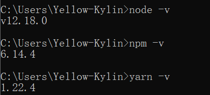

## 1. 准备工作

1.下载安装 [Node.js](https://nodejs.org/en/) 和 [Yarn](https://yarnpkg.com/latest.msi) ，nodejs安装时会自动安装npm，yarn和nodejs如今都自动添加系统环境变量，只需要重新启动一下电脑就行，分别验证：




2.安装VuePress

```shell
# Install vuepress.
yarn global add vuepress
```


## 2.搭建Blog平台

1.安装博客主题

```shell
# Install the theme.
yarn global add @vuepress-reco/theme-cli
# Upgrade.
#yarn global upgrade @vuepress-reco/theme-cli

# 初始化（需要回答一些问题，最后一个选择： blog）
theme-cli init my-blog

# 安装
cd my-blog
yarn install
```


这将生成一个博客网站模板“my-blog”，其中“docs”文件夹里面是主要的源文件，包括配置和博客文章的 Markdown 文件。


2.修改和定制

```shell
# 打开本地服务
# Or: vuepress dev docs
yarn dev
```


打开本地服务后，VuePress 的开发环境可通过浏览器访问 http://localhost:8080/。在`docs\.vuepress\config.js`中设定。编译生成的静态网页将位于“public”文件夹中。

```shell
# 编译生成静态网页
yarn build
```


编译生成的静态网页将位于“public”文件夹中。在生成的模板上，随即更新 `package.json` 中的依赖，使用最新的版本

````shell
"devDependencies": {
    "vuepress": "1.5.0",
    "vuepress-theme-reco": "1.2.2"
  }
````

然后升级本地的依赖包：

```shell
yarn install
yarn upgrade
```

为了避免将目录链接里面的文件重复加入到 Git 的版本控制，我们需要在 `.gitignore` 中，添加一条设置，忽略建立的目录链接。例如：

```text
# ignore directory junctions.
/docs/views/other/guide/asset/
```


3.图片引用

关于图片文件的引用，有一个小技巧:

1. 在 `docs\.vuepress\public\views\` 和 `docs\views\` 中建立同样的目录结构。其中前者是 VuePress 要求存放图片文件的地方，后者是 Markdown 博客文章 Markdown 文件的存放地方。
2. 为了让 Typora 编辑器打开 Markdown 文件时能够显示图片，同时又能让图片文件位于 VuePress 所要求的文件夹，我们需要在  Markdown 文件所在的文件夹中，建立一个目录连接（Directory Junction），让它指向 VuePress  要求的文件夹中（那里存放着图片文件）。

举个例子， `docs\.vuepress\public\views\other\guide\asset\` 中，存放了几张图片文件。在 Markdown 文件`README.md` 所处的文件夹 `docs\views\other\guide\`中，我们建立了一个 `asset` 目录链接，它以相对路径的方式指向了`docs\.vuepress\public\views\other\guide\asset\`。

````shell
REM We would like to create a directory junction "asset" from:
REM docs\views\other\study\
REM to: 
REM docs\.vuepress\public\views\other\study\asset\

REM First, check if the relative path is correct:
CD /D\my-blog\docs\views\other\study\
DIR ..\..\..\.vuepress\public\views\other\study\asset

REM Then, run the command to create the directory junction:
MKLINK /J asset ..\..\..\.vuepress\public\views\other\study\asset
````


4.Git版本控制

另外，为了避免将目录链接里面的文件重复加入到 Git 的版本控制，我们需要在 `.gitignore` 中，添加一条设置，忽略建立的目录链接。例如：

```shell
# ignore directory junctions.
/docs/views/other/guide/asset/
```


5.最后

打开本地服务，一边用 Typora 编辑 Markdown 文章，一边用浏览器（http://localhost:8080）看效果。每次保存 Markdown 文件，浏览器的结果会自动更新（不需要手动刷新），非常方便快捷。

```shell
# 打开本地服务
# Or: vuepress dev docs
yarn dev
```

本地开发满意后，在 GitHub （也可以是 GitLab等类似的版本控制托管服务）中建立一个代码库，将本地代码提交到代码库中。


## 3.发布到 Netlify

发布到 [Netlify.com](https://www.netlify.com)，只需要简单几步：

1. 注册 Netlify 的账号并登录，需要提供一个电子邮件。

   

   

2. 新建一个项目，在设置里面填入 GitHub 代码库的链接，填写构建的命令和输出文件夹。
   按“Deploy site”按钮，耐心等候5分钟左右时间，让构建流程正常结束。

   

   

3. 构建成功后，设置定制的域名。
   例如这里，我设置了定制的域名“jason70rever”，于是可以这样访问此博客网站：
   https://jason70rever.netlify.app/

   

4. 【可选】每次提交到 GitHub，Netlify 将自动构建并发布网站。为了了解构建状态，在首页（README.md）中添加一个“status badge”。

   


## 4.小结

本文简明扼要地给出了基于 VuePress 搭建个人博客网站的全过程，有些技术细节没有提及，读者应该也是技术人员，相信您有能力自行探索或调整。希望本文对您有所帮助。