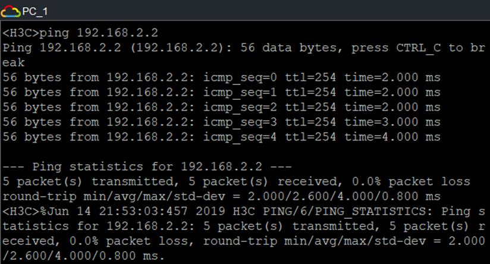

本次企业网络架构是本人云网络系统集成的大作业，是基于华三设备进行设计和模拟实现的。


## 1 需求分析

### 1.1 网络规划要求

1.拓扑为一个企业网但是被分隔在三个不同的地理位置，企业总部和各分支机构内部地址利用私有专用地址进行配置。

### 1.2 总部配置要求

1.总部有两个VLAN要求在SW1交换机上正确的规划和实现，并在R1上对这两个VLAN进行单臂路由。

2.企业总部交换机SW1上作VLAN配置，使VLAN2和VLAN3之间能够互相访问。

3.总部和分支2机构之间Serial口相连，配置帧中继FR， DLCI=102，启用PAP认证。

4.要求整个企业网三层设备上（路由器、防火墙）启动OSPF动态路由协议，并作单区域配置。

5.总部MAIL服务器对各分支机构提供邮箱服务，将邮件服务器内网地址192.168.2.2在R1路由器端口GE_0/1上映射为外网地址202.202.2.100供分支1访问，请在路由器R1上做相应的NAT设置。

### 1.3 分支1配置要求

1.要求整个企业网三层设备上（路由器、防火墙）启动OSPF动态路由协议，并作单区域配置。

2.企业网分支1可以访问总部，但不能访问分支2。且所有由分支1流出的报文，在防火墙外端口（GE_0/0）上将源地址转换为202.202.1.2的外端口地址。

3.防火墙上配置aspf策略，要求对http协议进行检测、对smtp协议进行检测、对ftp协议进行检测。

### 1.4 分支2配置要求

1.要求整个企业网三层设备上（路由器、防火墙）启动OSPF动态路由协议，并作单区域配置。

2.分支2和总部之间Serial口相连，配置帧中继FR， DLCI=102，启用PAP认证。

3.在分支2的R2路由器上作相应设置，使企业网分支2可以访问总部也可以访问分支1，但访问分支1的时间限制在工作日时间的9:00—17：00。


## 2 拓扑搭建

### 2.1 网络拓扑图


### 2.2 IP地址规划

设备IP地址分配

| 设备名   | 端口           | 端口IP         |
| -------- | -------------- | -------------- |
| R1       | GE_0/0.1       | 192.168.2.1/24 |
| GE_0/0.2 | 192.168.3.1/24 |                |
| GE_0/1   | 202.202.1.1/24 |                |
| Ser_1/0  | 202.202.2.1/24 |                |
| R2       | GE_0/0         | 192.168.3.3/24 |
| Ser_1/0  | 202.202.2.2/24 |                |
| Firewall | GE_0/0         | 202.202.1.2/24 |
| GE_0/1   | 192.168.4.1/24 |                |

服务器及PC的IP地址分配

| PC_1 | GE_0/1(GE0/0/1) | 192.168.3.2/24 | 192.168.3.1/24 |
| ---- | --------------- | -------------- | -------------- |
| PC_2 | GE_0/1(GE0/0/1) | 192.168.3.4/24 | 192.168.3.3/24 |
| PC_3 | GE_0/1(GE0/0/1) | 192.168.4.2/24 | 192.168.4.3/24 |


## 3 设备配置

### 3.1 总部区域vlan配置

创建VLAN，分别创建将接口加入VLAN2、VLAN3，并进入VLAN接口，配置管理IP，之后将GE_0/2设置为TRUNK端口。

​	SW1：

````shell
<H3C>sys
System View: return to User View with Ctrl+Z.
[H3C]sysname hql_SW1
[hql_SW1]vlan 2                                            //创建vlan2
[hql_SW1-vlan2]port gi 1/0/1                               //加入GE_0/1接口
[hql_SW1-vlan2]vlan 3
[hql_SW1-vlan3]port gi 1/0/3
[hql_SW1-vlan3]quit
[hql_SW1]int Vlan-interface 2                              //进入VLAN2接口
[hql_SW1-Vlan-interface2]ip address 192.168.2.3 24         //配置管理IP
[hql_SW1-Vlan-interface2]quit
[hql_SW1]int Vlan-interface 3
[hql_SW1-Vlan-interface3]ip address 192.168.3.5 24
[hql_SW1-Vlan-interface3]quit
[hql_SW1]int gi 1/0/2
[hql_SW1-GigabitEthernet1/0/2]port link-type trunk        //将端口类型改TRUNK
[hql_SW1-GigabitEthernet1/0/2]port trunk permit vlan all  //允许通过的VLAN
[hql_SW1-GigabitEthernet1/0/2]quit
````

### 3.2 单臂路由配置

在R1上GE_0/0口上做单臂路由子接口，对两个VLAN进行单臂路由，实现VLAN间的互通。

​	R1：

````shell
<H3C>sys
System View: return to User View with Ctrl+Z.
[H3C]sysname hql_R1
[hql_R1]int gi 0/0.1                                  //创建子接口
[hql_R1-GigabitEthernet0/0.1]ip address 192.168.2.1 24  
[hql_R1-GigabitEthernet0/0.1]vlan-type dot1q vid 2 //指定逻辑子接口对应vlan
[hql_R1-GigabitEthernet0/0.1]int gi 0/0.2
[hql_R1-GigabitEthernet0/0.2]ip address 192.168.3.1 24
[hql_R1-GigabitEthernet0/0.2]vlan-type dot1q vid 3
[hql_R1-GigabitEthernet0/0.2]quit
````

### 3.3 配置PAP认证

在R1与R2之间用点对点PPP协议，配置PAP验证。

​	R1：

````shell
[hql_R1]int ser 1/0
[hql_R1-Serial1/0]ip address 202.202.2.1 24
[hql_R1-Serial1/0]link-protocol ppp                       //封装PPP
[hql_R1-Serial1/0]ppp authentication-mode pap             //设置验证类型
[hql_R1-Serial1/0]quit
[hql_R1]local-user hql class network                      //设置用户名
New local user added.
[hql_R1-luser-network-hql]password simple 2017441393      //设置口令
[hql_R1-luser-network-hql]service-type ppp                //设置服务类型
[hql_R1-luser-network-hql]quit 
````

​	R2：

````shell
<H3C>sys
System View: return to User View with Ctrl+Z.
[H3C]sysname hql_R2
[hql_R2]int gi 0/0
[hql_R2-GigabitEthernet0/0]ip address 192.168.3.3 24
[hql_R2-GigabitEthernet0/0]int ser 1/0
[hql_R2-Serial1/0]ip address 202.202.2.2 24
[hql_R2-Serial1/0]link-protocol ppp
[hql_R2-Serial1/0]ppp authentication-mode pap
[hql_R2-Serial1/0]ppp pap local-user hql password simple 2017441393
[hql_R2-Serial1/0]quit
````

### 3.4 配置帧中继FR

配置R1与R2之间用帧中继FR协议， DLCI=102。

​	R1：

````shell
[hql_R1]int ser 1/0
[hql_R1-Serial1/0]link-protocol fr         //封装帧中继协议
[hql_R1-Serial1/0]fr interface-type dce   
//配置帧中继接口的终端类型
[hql_R1-Serial1/0]fr dlci 102              
//为主接口分配一条虚电路号
[hql_R1-Serial1/0-fr-dlci-102]quit 
[hql_R1-Serial1/0]fr inarp ip 102          
//动态建立：使能动态逆向地址解析协议 
[hql_R1-Serial1/0]quit
````

​	R2：

````shell
[hql_R2]int ser 1/0
[hql_R2-Serial1/0]link-protocol fr
[hql_R2-Serial1/0]fr interface-type dte
[hql_R2-Serial1/0]fr dlci 102
[hql_R2-Serial1/0-fr-dlci-102]quit
[hql_R2-Serial1/0]fr inarp ip 102
````

### 3.5 启动OSPF动态路由协议

在R1、R2、Firewall中启动OSPF动态路由协议，宣告网段。因为R1与R2直接配置了帧中继协议，所以需要在R1、R2上手动添加邻居。在防火墙上配置域间策略，允许报文通过。

​	R1：

````shell
[hql_R1]int gi 0/1
[hql_R1-GigabitEthernet0/1]ip address 202.202.1.1 24
[hql_R1-GigabitEthernet0/1]quit
[hql_R1]int ser 1/0
[hql_R1-Serial1/0]ospf dr-priority 25        
//手动调整优先级，使路由器成为DR
[hql_R1-Serial1/0]ospf network-type nbma
[hql_R1-Serial1/0]quit
[hql_R1]router id 1.1.1.1                             
//配置路由器router ID
[hql_R1]ospf                                         
//启动ospf协议
[hql_R1-ospf-1]peer 202.202.2.2                       
//手动添加邻居
[hql_R1-ospf-1]area 0                                 
//配置ospf区域
[hql_R1-ospf-1-area-0.0.0.0]network 1.1.1.1 0.0.0.0   
//宣告网段
[hql_R1-ospf-1-area-0.0.0.0]network 202.202.2.0 0.0.0.255
[hql_R1-ospf-1-area-0.0.0.0]network 202.202.1.0 0.0.0.255 
[hql_R1-ospf-1-area-0.0.0.0]network 192.168.2.0 0.0.0.255
[hql_R1-ospf-1-area-0.0.0.0]quit
````

​	R2:

```shell
[hql_R2-Serial1/0]ospf dr-priority 0
[hql_R2-Serial1/0]ospf network-type nbma
[hql_R2-Serial1/0]quit
[hql_R2]router id 2.2.2.2                           
[hql_R2]ospf                                     
[hql_R2-ospf-1]peer 202.202.2.1
[hql_R2-ospf-1]area 0
[hql_R2-ospf-1-area-0.0.0.0]network 2.2.2.2 0.0.0.0
[hql_R2-ospf-1-area-0.0.0.0]network 202.202.2.0 0.0.0.255
[hql_R2-ospf-1-area-0.0.0.0]network 192.168.3.0 0.0.0.255
[hql_R2-ospf-1-area-0.0.0.0]quit
```

​	Firewall：

```
<H3C>sys
System View: return to User View with Ctrl+Z.
[H3C]sysname hql_firewall
[hql_firewall]int gi 1/0/0
[hql_firewall-GigabitEthernet1/0/0]ip address 202.202.1.2 24
[hql_firewall-GigabitEthernet1/0/0]int gi 1/0/1
[hql_firewall-GigabitEthernet1/0/1]ip address 192.168.4.1 24
[hql_firewall]security-zone name Trust                    //将端口加入Trust域
[hql_firewall-security-zone-Trust]import int gi 1/0/1   
[hql_firewall-security-zone-Trust]quit
[hql_firewall]security-zone name DMZ
[hql_firewall-security-zone-DMZ]import int gi 1/0/0
[hql_firewall-security-zone-DMZ]quit
[hql_firewall]object-policy ip manage            
//配置对象策略，允许所有流量
[hql_firewall-object-policy-ip-manage]rule pass
[hql_firewall-object-policy-ip-manage]quit
[hql_firewall]zone-pair security source DMZ destination Local   
//配置域间策略
[hql_firewall-zone-pair-security-Trust-Local]object-policy apply ip manage
[hql_firewall]zone-pair security source Trust destination Local
[hql_firewall-zone-pair-security-Trust-Local]object-policy apply ip manage
[hql_firewall-zone-pair-security-Trust-Local]quit
[hql_firewall]zone-pair security source local destination TRUST
[hql_firewall-zone-pair-security-Local-Trust]object-policy apply ip manage
[hql_firewall-zone-pair-security-Local-Trust]quit
[hql_firewall]zone-pair security source DMZ destination TRUST
[hql_firewall-zone-pair-security-DMZ-Trust]object-policy apply ip manage
[hql_firewall-zone-pair-security-DMZ-Trust]quit
[hql_firewall]zone-pair security source Trust destination DMZ
[hql_firewall-zone-pair-security-Trust-DMZ]object-policy apply ip manage
[hql_firewall-zone-pair-security-Trust-DMZ]quit
```

### 3.6 配置防火墙策略

配置防火墙域间策略，拒绝发往分支2的报文，在防火墙外端口（GE_0/0）上做静态转换将源地址转换为202.202.1.2。

​	Firewall：

```
[hql_firewall]acl adv 3700                              
//配置acl控制的域间策略
[hql_firewall-acl-ipv4-adv-3700]rule 0 deny ip destination 192.168.3.4 0.0.0.0
[hql_firewall]zone-pair security source Trust destination DMZ
[hql_firewall-zone-pair-security-Trust-DMZ]packet-filter 3700
[hql_firewall-zone-pair-security-Trust-DMZ]quit
[hql_firewall]nat static outbound 192.168.4.0 202.202.1.2    //配置静态nat转换
[hql_firewall]int gi 1/0/0
[hql_firewall-GigabitEthernet1/0/0]nat static enable
```

### 3.7 配置分支2策略

在R2路由器上作相应设置，使企业网分支2可以访问总部也可以访问分支1，但访问分支1的时间限制在工作日时间的9:00—17：00。

​	R2：

```
[hql_R2]time-range worktime 09:00 to 17:00 working-day    //设置工作时间
[hql_R2]acl adv 3500                                      //用acl控制访问时间
[hql_R2-acl-ipv4-adv-3500]rule permit ip destination 192.168.4.0 0.0.0.255 time-range worktime
[hql_R2-acl-ipv4-adv-3500]int ser 1/0                     //在端口出方向运用
[hql_R2-Serial1/0]nat outbound 3500
[hql_R2-Serial1/0]quit
```

### 3.8 防火墙上配置aspf策略

防火墙上配置aspf策略，要求对http协议进行检测、对smtp协议进行检测、对ftp协议进行检测。

​	Firewall：

```
[hql_firewall]aspf policy 1
[hql_firewall-aspf-policy-1]detect http               
//对http进行检测
[hql_firewall-aspf-policy-1]detect smtp               
//对smtp进行检测
[hql_firewall-aspf-policy-1]detect ftp                
//对ftp进行检测
[hql_firewall-aspf-policy-1]quit
```

### 3.9 配置总部静态映射

在路由器R1上做相应的NAT设置将邮件服务器内网地址192.168.2.2在R1路由器端口GE_0/1上映射为外网地址202.202.2.100供分支1访问。

​	R1：

```
[hql_R1-address-group-1]int gi 0/1                    
//nat静态映射
[hql_R1-GigabitEthernet0/1]nat server global 202.202.2.100 inside 192.168.2.2
```


## 4 分析

### 4.1 企业网互通测试

使用单臂路由（router-on-a-stick），通过在路由器的一个接口上通过配置子接口（或“逻辑接口”，并不存在真正物理接口）的方式，实现原来相互隔离的不同VLAN（虚拟局域网）之间的互联互通，如图4.1、4.2所示。

VLAN能有效分割局域网，实现各网络区域之间的访问控制。但现实中，往往需要配置某些VLAN之间的互联互通。比如，你的公司划分为领导层、销售部、财务部、人力部、科技部、审计部，并为不同部门配置了不同的VLAN，部门之间不能相互访问，有效保证了各部门的信息安全。但经常出现领导层需要跨越VLAN访问其他各个部门，这个功能就由单臂路由来实现。

单臂路由优点：实现不同vlan之间的通信，有助理解、学习VLAN原理和子接口概念。

单臂路由缺点：容易成为网络单点故障，配置稍有复杂，现实意义不大。

​	 MAIL服务器ping通PC_1：


​	

PC_1 ping通MAIL服务器：




### 4.3 OSPF邻居信息

防火墙OSPF邻居信息由与路由器直接启动单区域OSPF动态路由协议自动生成，具体信息如图所示：

  


路由器R1与R2直接由于配置了帧中继协议，OSPF邻居需手动配置，路由器R1的OSPF邻居信息如图所示：


路由器R2的OSPF邻居信息如图所示：

 


### 4.4连通性测试

由需求分析可知分支2可以访问总部及分支1，如图所示：


分支1可以访问总部，不可访问分支2，如图所示。 


### 4.5 NAT 转换信息

由需求分析，需在防火墙外端口上做NAT转换，NAT转换信息如图所示：


在路由器R1的端口上完成NAT静态映射，NAT转换信息如图所示：


###  4.6分析：帧中继网络特性

在路由器R1上PING自已帧中继网络的IP 202.202.2.1不能PING通，PING对方IP能PING通。

帧中继接口对接，查看IP状态摘要会看到状态是UP，而协议是DOWN，因为帧中继接口不能对接使用,在中间必须要加一个帧中继交换机。帧中继交换机配置完毕，在路由器R1与路由器R2上要配置封装以及IP地址，地址要在同一网段。这时再用命令查看会看到状态和协议都是UP。但是，PING对端是通的，PING自己端口还是不通的。我们必须要使用命令frame-relay map ip ，才能看到多了一条静态映射，这样能ping通了。

### 4.7分析：OSPF特别解决方案

帧中继网络是一个非广播型的网络，而OSPF协议是以组播的形式向外发布路由信息的，因而路由器无法在帧中继网络上无法发送hello包。从而路由器R1和路由器R2将会无法学习到对方的路由信息。

帧中继在实施是有两种方案：NBMA和点到点子接口，其中NBMA是所有的广域网链路都在同一个IP网段里；点到点子接口是每一条链路都在一个独立的IP网段里。有两种方法可以解决形成邻居的问题：一是在接口下申明可以广播；二是在接口下配置单播更新，让HELLO包通过单播方式传输。

方法一：在默认的NBMA环境下手动制定邻居，DR、IP和DLCI的对应关系。

方法二：使用ospf network-type broadcast命令将接口改成BMA多路访问广播类型。

方法三：使用ospf network-type p2mp命令将接口改成点到多点类型。

方法四：划分子接口，使用ospf network-type p2p将接口改成点到点模式。